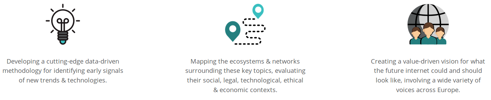
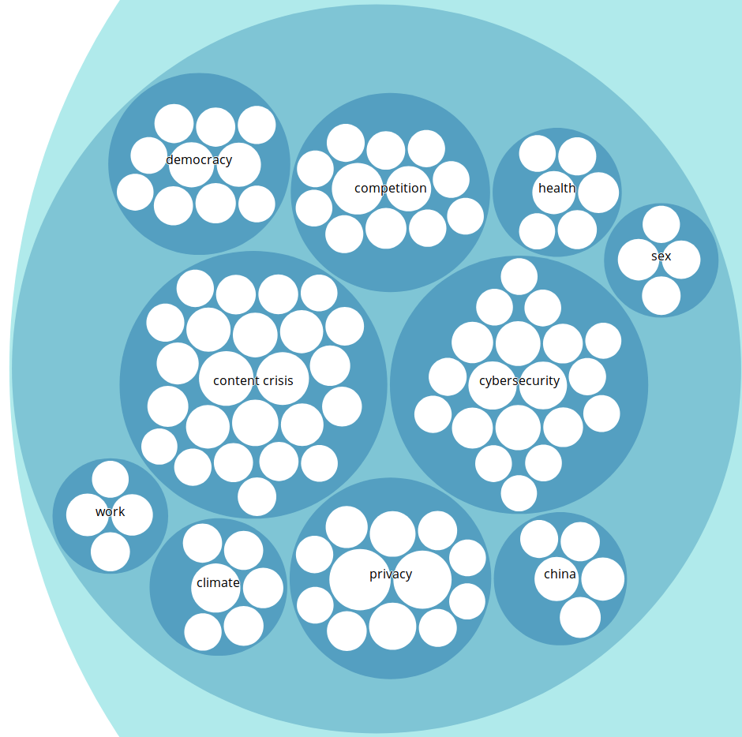
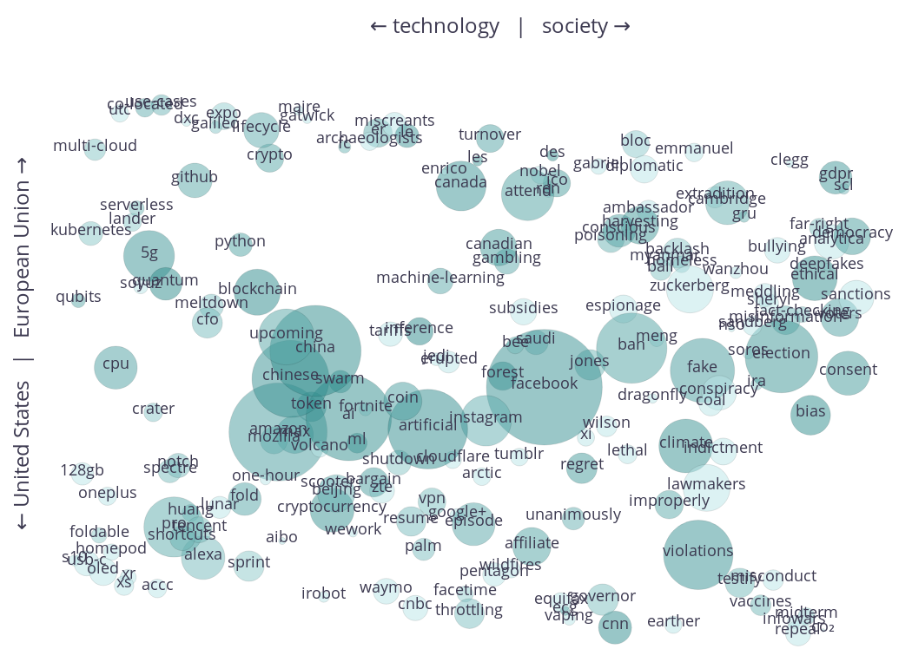
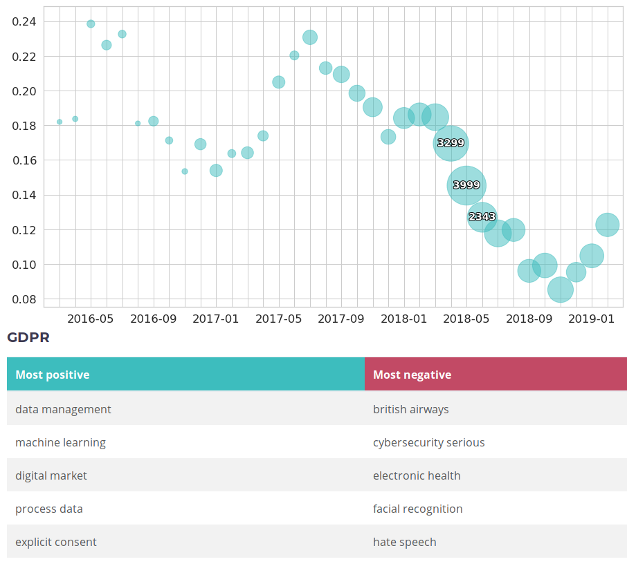
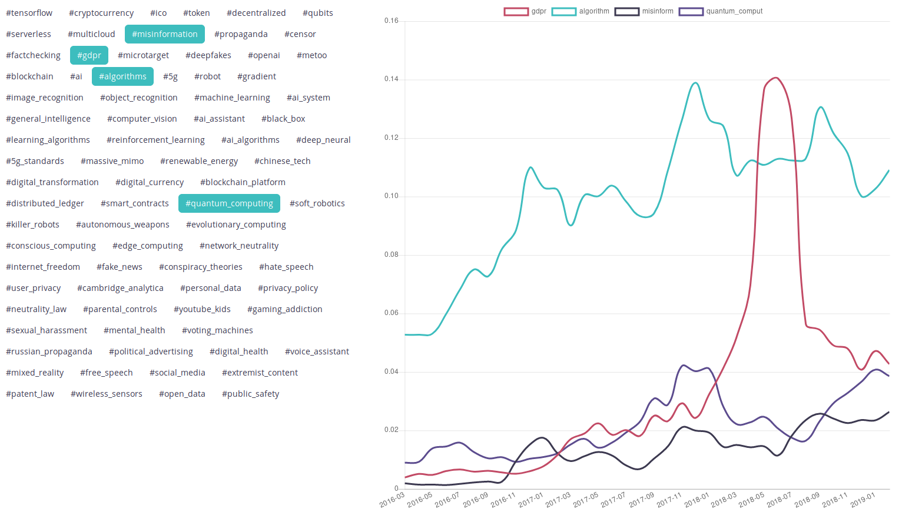
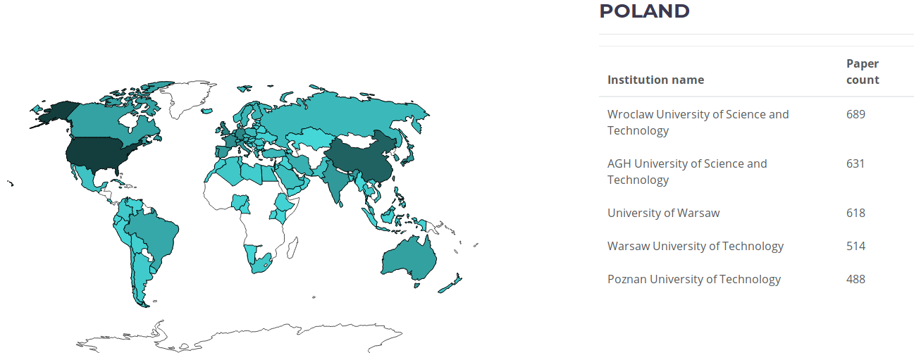

# engineroom

<<<<<<< HEAD
# Results website: [ngi.delabapps.eu](https://ngi.delabapps.eu/)

## EU Engineroom focuses on identifying and evaluating the key enabling technologies and topics that will underpin the Next Generation Internet in 2025.

### Engineroom’s three key pillars:

=======
EU Engineroom focuses on identifying and evaluating the key enabling technologies and topics that will underpin the Next Generation Internet in 2025.
>>>>>>> 0cd159f401e3f5c0fe800013dd578d725f38fc98

 This work is licensed under a <a rel="license" href="http://creativecommons.org/licenses/by-nc-sa/4.0/">Creative Commons Attribution-NonCommercial-ShareAlike 4.0 International License</a>.